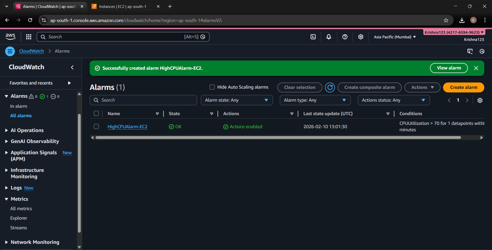
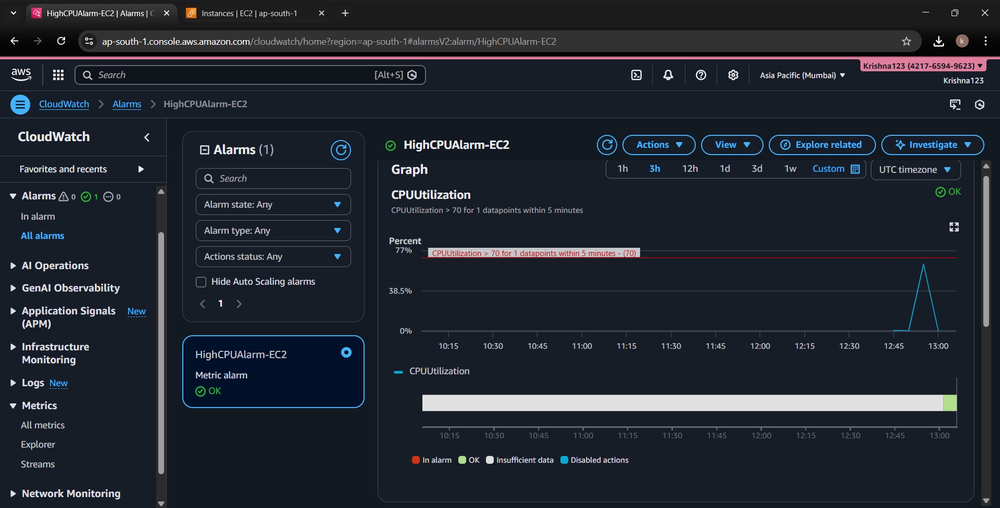
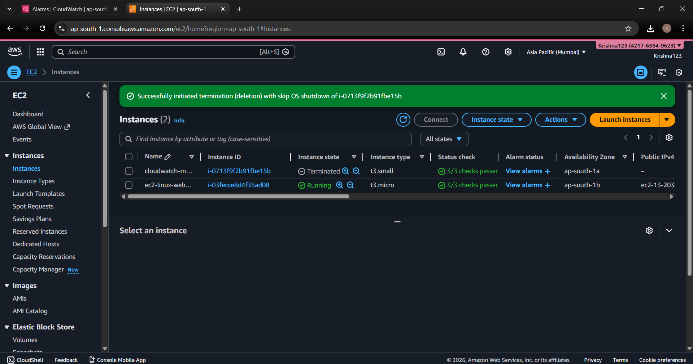

# EC2 Monitoring & Alerts using AWS CloudWatch

This project demonstrates how to monitor an Amazon EC2 instance using **AWS CloudWatch** and configure **automated alerts** using **Amazon SNS**.  
It focuses on real-world monitoring, alerting, and safe resource cleanup practices.

---

## 🔧 Services Used
- Amazon EC2
- Amazon CloudWatch
- Amazon SNS
- Amazon Linux 2023

---

## 📌 What I Implemented
- Launched an EC2 instance (Amazon Linux 2023)
- Monitored CPU utilization using CloudWatch metrics
- Created a threshold-based CloudWatch alarm (CPU > 70%)
- Configured SNS email notifications for alerts
- Tested the alarm by generating CPU load
- Cleaned up AWS resources to avoid unnecessary costs

---

## 📊 CPU Monitoring (CloudWatch)
The **CPUUtilization** metric was monitored using a **5-minute average period**.

### CloudWatch Alarm List

---

## 🚨 Alarm Trigger & Graph
An alarm was configured to trigger when CPU utilization exceeded **70%**, visualized using CloudWatch graphs.

### CPU Utilization Alarm Graph

---

## 🧹 Resource Cleanup
After testing, the EC2 instance was **terminated** to prevent ongoing charges.

### EC2 Instance Termination

---

## 🧠 Key Learnings
- Understanding EC2 performance metrics
- Monitoring infrastructure using CloudWatch
- Creating metric-based alarms
- Integrating SNS for alert notifications
- AWS cost management through proper cleanup

---

## ✅ Outcome
This project demonstrates **basic cloud monitoring and alerting skills**, which are essential for:
- Cloud / DevOps roles
- Infrastructure monitoring
- Production readiness and cost control
